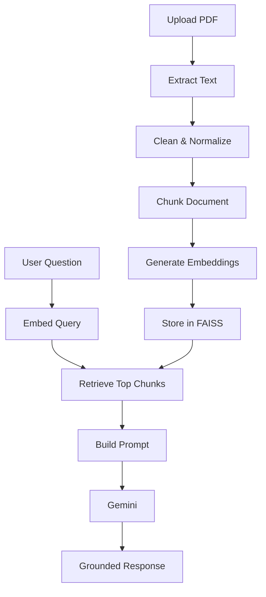

<div align="center">

# 📚 AI Study Assistant

### AI-powered document understanding platform built with **FastAPI**, **FAISS**, and **Google Gemini**

Upload study materials, organize them into workspaces, and interact with your documents using Retrieval-Augmented Generation (RAG).


</div>

---

# ✨ Overview

AI Study Assistant is a backend system that enables students to upload study materials and ask questions grounded in those documents.

The platform follows a modular architecture and implements a complete Retrieval-Augmented Generation (RAG) pipeline including document ingestion, semantic retrieval, prompt construction, and LLM-powered responses.

---

# 🚀 Features

## Authentication

- JWT Authentication
- Access & Refresh Tokens
- Password Hashing
- Protected Routes

---

## Workspace Management

- Create Workspace
- Update Workspace
- Delete Workspace
- Manage Documents

---

## Document Processing

- PDF Upload
- PDF Parsing
- Text Cleaning
- Text Normalization
- Metadata Extraction

---

## Text Pipeline

- Intelligent Chunking
- Configurable Chunk Size
- Tokenization
- Pre-processing

---

## AI Pipeline

- Embedding Generation
- FAISS Vector Storage
- Semantic Retrieval
- Prompt Builder
- Google Gemini Integration
- Retrieval-Augmented Generation (RAG)

---

## Backend Architecture

- FastAPI
- SQLAlchemy ORM
- Alembic
- Repository Pattern
- Dependency Injection
- Modular Services
- Pydantic Validation

---

# 🏗 System Architecture

```text
                     Client
                        │
                        ▼
                  FastAPI Server
                        │
        ┌───────────────┼────────────────┐
        │               │                │
        ▼               ▼                ▼
 Authentication   Workspace API    Document API
                                          │
                                          ▼
                                   Upload PDF
                                          │
                                          ▼
                                    PDF Parser
                                          │
                                          ▼
                               Text Processing
                                          │
                                          ▼
                                     Chunking
                                          │
                                          ▼
                               Embedding Service
                                          │
                                          ▼
                                 FAISS Vector DB
                                          │
                                          ▼
                                 Semantic Retrieval
                                          │
                                          ▼
                                  Prompt Builder
                                          │
                                          ▼
                                    Gemini LLM
                                          │
                                          ▼
                                   AI Response
```

---

# 🔄 RAG Pipeline



---

# 📂 Project Structure

```text
backend/
│
├── alembic/
│
├── app/
│   ├── ai/
│   ├── api/
│   ├── chunking/
│   ├── core/
│   ├── database/
│   ├── dependencies/
│   ├── embedding/
│   ├── exceptions/
│   ├── llm/
│   ├── pdf/
│   ├── prompts/
│   ├── rag/
│   ├── repositories/
│   ├── retrieval/
│   ├── schemas/
│   ├── security/
│   ├── services/
│   ├── storage/
│   ├── text/
│   ├── utils/
│   ├── vectorstore/
│   └── workers/
│
├── tests/
├── storage/
└── pyproject.toml
```

---

# 🛠 Tech Stack

| Category | Technologies |
|-----------|--------------|
| Language | Python 3.12 |
| Framework | FastAPI |
| ORM | SQLAlchemy |
| Validation | Pydantic |
| Database | SQLite / PostgreSQL |
| Migrations | Alembic |
| Vector Store | FAISS |
| Embeddings | Sentence Transformers |
| LLM | Google Gemini |
| Authentication | JWT |
| Testing | Pytest |

---

# 📡 API Overview

## Authentication

```http
POST /api/v1/auth/register
POST /api/v1/auth/login
POST /api/v1/auth/refresh
```

---

## Workspace

```http
GET    /api/v1/workspaces
POST   /api/v1/workspaces
PUT    /api/v1/workspaces/{id}
DELETE /api/v1/workspaces/{id}
```

---

## Documents

```http
POST /api/v1/documents/upload
GET  /api/v1/documents/{id}
DELETE /api/v1/documents/{id}
```

---

## Chat

```http
POST /api/v1/chat
```

Example Request

```json
{
    "workspace_id":"workspace-id",
    "message":"Explain the Transformer architecture."
}
```

Example Response

```json
{
    "answer":"The Transformer architecture is...",
    "citations":[]
}
```

---

# ⚙️ Installation

Clone the repository

```bash
git clone https://github.com/Vishaldave45/ai-study-assistant.git

cd ai-study-assistant/backend
```

Create virtual environment

```bash
python -m venv .venv
```

Activate

Linux/macOS

```bash
source .venv/bin/activate
```

Windows

```powershell
.venv\Scripts\activate
```

Install dependencies

```bash
pip install -e .
```

Create `.env`

```env
DATABASE_URL=
JWT_SECRET_KEY=
GEMINI_API_KEY=
```

Run database migrations

```bash
alembic upgrade head
```

Start server

```bash
uvicorn app.main:app --reload
```

Open API Documentation

```
http://localhost:8000/docs
```

---

# 🧪 Testing

Run all tests

```bash
pytest
```

---

# 🛣 Development Roadmap

| Module | Status |
|---------|--------|
| Authentication | ✅ |
| Workspace Management | ✅ |
| PDF Upload | ✅ |
| PDF Parsing | ✅ |
| Text Processing | ✅ |
| Chunking | ✅ |
| Embedding Pipeline | ✅ |
| FAISS Vector Store | ✅ |
| Semantic Retrieval | ✅ |
| Prompt Builder | ✅ |
| Gemini Integration | ✅ |
| Retrieval-Augmented Generation | ✅ |
| AI Summaries | 🚧 |
| Flashcards | 🚧 |
| Quiz Generation | 🚧 |
| Concept Explanation | 🚧 |
| Knowledge Graph | 🚧 |
| Conversation Memory | 🚧 |
| Evaluation Framework | 🚧 |

---

# 🤝 Contributing

Contributions, suggestions, and issue reports are welcome.

1. Fork the repository
2. Create a feature branch
3. Commit your changes
4. Open a Pull Request

---

# 📄 License

This project is licensed under the MIT License.
