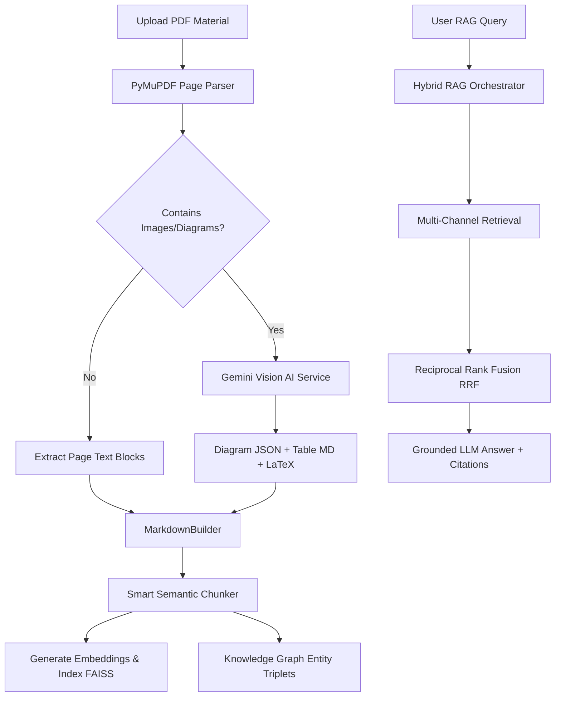

<div align="center">

# 📚 AI Study Assistant v2

### Enterprise AI-powered document understanding platform built with **React 19**, **FastAPI**, **Multimodal Vision AI**, **Hybrid Multi-Retriever RAG**, **FAISS**, and **Google Gemini 2.5**

Upload complex study materials (PDFs), organize them into workspaces, inspect documents with smart data tables and visual AI panels, extract interactive diagrams (Mermaid.js), Markdown tables & LaTeX equations, query via hybrid RRF vector retrieval, generate AI summaries & master revision booklets, and build knowledge graph concept links.

[](https://react.dev/)
[](https://www.typescriptlang.org/)
[](https://vitejs.dev/)
[](https://fastapi.tiangolo.com/)
[](https://www.python.org/)
[](https://tanstack.com/)
[](https://redux-toolkit.js.org/)
[](https://vitest.dev/)
[](https://playwright.dev/)
[](https://docs.pytest.org/)
[](LICENSE)

---

[📖 Overview](#-overview) • [✨ Core Features](#-core-features) • [🧠 Document Intelligence Engine v2](#-document-intelligence-engine-v2) • [🏗️ Architecture](#️-system-architecture) • [📂 Project Structure](#-project-structure) • [🛠️ Tech Stack](#️-tech-stack) • [🚀 Quick Start](#-quick-start) • [🧪 Testing](#-testing-suite)

---

</div>

## 📖 Overview

**AI Study Assistant v2** is an enterprise-grade full-stack platform that enables students, researchers, and technical professionals to ingest complex study materials and ask grounded questions using **Multimodal Document Intelligence** and **Hybrid Multi-Retriever RAG**.

The platform parses layout-rich PDF documents, extracts embedded visual diagrams, structured tables, and mathematical formulas using Gemini Vision AI, weaves them into unified Markdown knowledge representations, indexes them with structure-aware semantic chunking, and serves interactive study features (Quizzes, Flashcards, Explanations, Knowledge Graphs) over multi-channel hybrid vector search.

> [!TIP]
> **Production Optimization**: Route-level code splitting (`React.lazy` + `Suspense`) keeps the initial bundle size under **163 kB gzip** for ultra-fast startup performance!

---

## ✨ Core Features

<details open>
<summary><b>🔒 1. Authentication & Security</b></summary>

- **JWT Authentication**: Access and Refresh Tokens with silent auto-refresh interceptors.
- **Route Guards**: `ProtectedRoute` and `GuestRoute` wrappers.
- **Type-safe Forms**: React Hook Form + Yup schema validation (`loginSchema`, `registerSchema`).

</details>

<details open>
<summary><b>📁 2. Smart Data Table & Workspace Management</b></summary>

- **Powered by @tanstack/react-table (v8)**.
- **Automatic Document Vector Indexing**: Uploaded PDFs automatically transition through `PROCESSING` -> text chunking -> SentenceTransformers embedding generation -> FAISS vector indexing -> `READY` state.
- Global search, per-column text filtering, multi-column sorting, row selection checkboxes, and pagination.

</details>

<details open>
<summary><b>🎨 3. Multimodal Document AI Panel (`DocumentAIPanel`)</b></summary>

- **Tabbed Visual Inspection**: Dedicated React tabs for **Diagrams** (with interactive Mermaid.js rendering), **Tables** (Markdown), and **Equations** (LaTeX formulas).
- **Diagram-to-Quiz / Flashcards**: One-click action triggers (`"Quiz from Diagram"`) generating interactive study materials directly from visual charts.

</details>

<details open>
<summary><b>📝 4. AI Summaries Library & Master Booklet Exporter</b></summary>

- **Automatic Summary Generator** for ingested workspace documents with 5 study format options (`short`, `detailed`, `bullet`, `revision_notes`, `key_takeaways`).
- **Summaries Library Table**: Interactive filtering by file format, title search, and date sorting.
- **Master Revision Booklet Exporter**: Select multiple summaries and export them as a single compiled Markdown booklet (`.md`) or copy to clipboard.

</details>

<details open>
<summary><b>💬 5. Hybrid RAG Chat & Multimodal Study Features</b></summary>

- **Multi-session RAG Chat Conversations** with history persistence.
- **Multi-Channel Parallel Retrieval**: Combines semantic vector search, parent-child context retrieval, and MMR diversity re-ranking via **Reciprocal Rank Fusion (RRF)**.
- **Page Citations**: Grounded answer references with exact document names and confidence match scores.

</details>

---

## 🧠 Document Intelligence Engine v2

The core backend features a 9-phase document intelligence engine (`backend/app/engine/`):

| Phase | Module Name | Architectural Responsibility |
| :--- | :--- | :--- |
| **Phase 1** | **Extensible Ingestion Engine** | Strategy Pattern (`BaseDocumentProcessor`) & Factory resolution for multi-format document extraction. |
| **Phase 2** | **Multimodal Vision AI** | Gemini Vision AI service extracting visual diagrams (JSON), tables (Markdown), and LaTeX equations. |
| **Phase 3** | **Unified Knowledge Representation** | `MarkdownBuilder` compiling raw text blocks and multimodal extractions into structured Markdown. |
| **Phase 4** | **Smart Structure-Aware Chunking** | `SmartSemanticChunker` creating typed chunks (`heading`, `paragraph`, `diagram`, `table`, `equation`). |
| **Phase 5** | **Multi-Retriever Hybrid Pipeline** | Query Planner + multi-channel parallel fan-out + Reciprocal Rank Fusion (RRF) scoring ($1 / (k + \text{rank})$). |
| **Phase 6** | **Frontend Multimodal Panel** | React component (`DocumentAIPanel`) displaying tabbed diagrams, tables, and LaTeX equations. |
| **Phase 7** | **Multimodal AI Study Features** | `DiagramFeatureService` generating quizzes, flashcards, and explanations from visual diagrams. |
| **Phase 8** | **Knowledge Graph Engine** | Entity triplet extraction (`source`, `relation`, `target`) and directional graph traversal. |
| **Phase 9** | **Async Ingest Worker** | Background worker with async event loop offloading & milestone progress callbacks (10% ➔ 100%). |

---

## 🏗️ System Architecture

<details>
<summary><b>🔍 View Data Flow Architecture Diagram</b></summary>

```text
               React Frontend (Vite + TypeScript)
                               │
               ┌───────────────┴───────────────┐
               ▼                               ▼
       TanStack Query / Table           Redux Toolkit / Axios
                               │
                               └───────────────┬───────────────┘
                                               │ (REST API / Bearer JWT)
                                               ▼
                                         FastAPI Server
                                               │
       ┌───────────────────────┬───────────────┴───────────────┬───────────────────────┐
       ▼                       ▼                               ▼                       ▼
Authentication           Workspace API                   Document API            Multimodal AI Panel
                                                               │
                                                               ▼
                                                  Document Engine Ingestion
                                                               │
                                                               ▼
                                                  Gemini Multimodal Vision AI
                                                               │
                                                               ▼
                                                  Smart Semantic Chunker
                                                               │
                                                               ▼
                                                  FAISS Vector DB & Graph
                                                               │
                                                               ▼
                                                  Hybrid Multi-Retriever RRF
                                                               │
                                                               ▼
                                                  Grounded Response & Citations
```

</details>

<details>
<summary><b>🔄 View Multimodal Document Processing Flow</b></summary>


```mermaid
flowchart TD

A[Upload PDF Material] --> B[PyMuPDF Page Parser]
B --> C{Contains Images/Diagrams?}
C -- Yes --> D[Gemini Vision AI Service]
C -- No --> E[Extract Page Text Blocks]
D --> F[Diagram JSON + Table MD + LaTeX]
E --> G[MarkdownBuilder]
F --> G
G --> H[Smart Semantic Chunker]
H --> I[Generate Embeddings & Index FAISS]
H --> J[Knowledge Graph Entity Triplets]
K[User RAG Query] --> L[Hybrid RAG Orchestrator]
L --> M[Multi-Channel Retrieval]
M --> N[Reciprocal Rank Fusion RRF]
N --> O[Grounded LLM Answer + Citations]
```

</details>

---

## 📂 Project Structure

<details>
<summary><b>📁 View Directory Tree</b></summary>

```text
ai-study-assistant/
├── backend/
│   ├── alembic/              # Database migration scripts
│   ├── app/                  # FastAPI backend application
│   │   ├── api/v1/           # REST endpoints (auth, workspace, document, chat, summary, rag, explain)
│   │   ├── core/             # Pydantic Settings & security config
│   │   ├── database/         # SQLAlchemy session & models
│   │   ├── engine/           # Document Intelligence Engine v2
│   │   │   ├── base.py       # Strategy pattern abstract document processor
│   │   │   ├── builder.py    # MarkdownBuilder unified knowledge representation
│   │   │   ├── chunker.py    # SmartSemanticChunker structure-aware chunking
│   │   │   ├── factory.py    # DocumentProcessorFactory strategy resolver
│   │   │   ├── features/     # Diagram feature service (quizzes, flashcards, explanations)
│   │   │   ├── graph/        # Knowledge graph service (concept triplets & traversal)
│   │   │   ├── processors/   # PyMuPDF page text & image parser
│   │   │   ├── retrieval/    # Hybrid RAG orchestrator, query planner, and RRF fusion
│   │   │   ├── schemas.py    # Pydantic schemas (PageObject, DiagramMetadata, TableMetadata)
│   │   │   ├── vision/       # Gemini Vision AI service
│   │   │   └── worker.py     # Async ingest background worker with progress tracking
│   │   ├── llm/              # LLM providers (Gemini, Groq, Demo) & service
│   │   ├── rag/              # Vector store, FAISS retriever, prompts
│   │   └── services/         # Business logic services
│   └── tests/                # Pytest test suite (164 tests across 32 files)
│
└── frontend/
    ├── e2e/                  # Playwright E2E test specs
    ├── src/
    │   ├── api/              # Axios & TanStack Query services
    │   ├── base-axios/       # Standardized Axios client wrappers
    │   ├── components/       # Primitive & feature components
    │   │   ├── features/     # Feature components (DocumentAIPanel)
    │   │   └── modals/       # WorkspaceModal, DocumentUploadModal
    │   ├── contexts/         # React Context API
    │   ├── hooks/            # Custom React hooks
    │   ├── modules/          # Domain feature modules
    │   ├── pages/            # Lazy-loaded route pages
    │   ├── redux/            # Redux Toolkit store & slices
    │   ├── styles/           # Global CSS variables & modern design system
    │   └── test/             # Vitest setup, MSW mock server & specs
    ├── playwright.config.ts  # Playwright E2E configuration
    └── vitest.config.ts      # Vitest unit test configuration
```

</details>

---

## 🛠️ Tech Stack

| Category | Technologies |
| :--- | :--- |
| **Frontend Core** | React 19, TypeScript 5.6, Vite 8, Lucide React Icons |
| **State Management** | Redux Toolkit (`@reduxjs/toolkit`), React Context API |
| **Data Fetching & Tables** | `@tanstack/react-query` (v5), `@tanstack/react-table` (v8) |
| **Forms & Validation** | `react-hook-form`, `@hookform/resolvers`, `yup` |
| **Frontend Testing** | Vitest (75 tests passed), Playwright E2E (5/5 spec files passed) |
| **Backend Framework** | Python 3.12, FastAPI, Pydantic v2 |
| **ORM & Database** | SQLAlchemy, Alembic, PostgreSQL / SQLite |
| **Document Processing** | PyMuPDF (`fitz 1.28.0`), Gemini Vision AI |
| **Vector Search & LLM** | FAISS, Google Gemini (`gemini-2.5-flash`), SentenceTransformers, RRF |
| **Backend Testing** | Pytest (164 tests passed across 32 files) |

---

## 🚀 Quick Start

### 1. Backend Setup

```bash
cd backend

# Install uv package manager
pip install uv

# Create virtual environment & sync dependencies
uv venv
source .venv/bin/activate  # Windows: .venv\Scripts\activate
uv sync --all-extras

# Run database migrations
alembic upgrade head

# Start FastAPI backend server
uvicorn app.main:app --reload
```

> [!NOTE]
> Backend server runs at `http://localhost:8000`. Interactive Swagger Docs: `http://localhost:8000/docs`.

---

### 2. Frontend Setup

```bash
cd frontend

# Install npm dependencies
npm install

# Start Vite development server
npm run dev
```

> [!NOTE]
> Frontend web app runs at `http://localhost:5173`.

---

## 🧪 Testing Suite

### ⚡ Frontend Vitest Unit & Integration Tests

```bash
cd frontend
npm run test
```

- ✅ **75/75 Passed (23 Test Files)**

### 🎭 Frontend Playwright E2E Tests

```bash
cd frontend
npx playwright test
```

- ✅ **5/5 Spec Files Passed**: Validates Auth, Workspace Documents, AI Chat, Summary Generator, and Analytics Table.

### 🐍 Backend Pytest Suite & Retrieval Benchmark

```bash
cd backend

# Run all 164 unit & integration tests
PYTHONPATH=. .venv/bin/pytest tests/ -v

# Run golden dataset retrieval evaluation benchmark (Hit Rate@k and MRR@k)
PYTHONPATH=. .venv/bin/python scripts/eval_retrieval.py --workspace-id <YOUR_WORKSPACE_UUID>
```

- ✅ **164/164 Passed**: Validates PyMuPDF extraction, Gemini Vision analysis, MarkdownBuilder, SmartSemanticChunker, Hybrid RAG RRF orchestrator, Knowledge Graph service, and Async Ingest Worker.

---

## 📄 License

This project is licensed under the **MIT License**.
