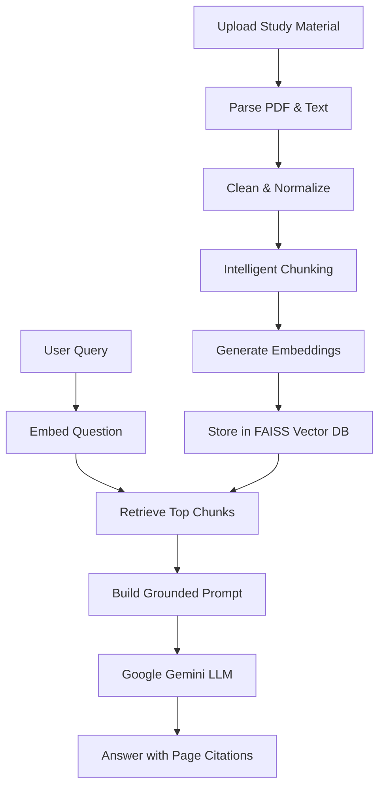

<div align="center">

# 📚 AI Study Assistant

### Enterprise AI-powered document understanding platform built with **React 19**, **FastAPI**, **TanStack Table & Query**, **FAISS**, and **Google Gemini**

Upload study materials, organize them into workspaces, inspect documents with smart data tables, generate AI summaries & master revision booklets, track real-time token costs, and interact with your documents using Retrieval-Augmented Generation (RAG).

[](https://react.dev/)
[](https://www.typescriptlang.org/)
[](https://vitejs.dev/)
[](https://fastapi.tiangolo.com/)
[](https://www.python.org/)
[](https://tanstack.com/)
[](https://redux-toolkit.js.org/)
[](https://vitest.dev/)
[](https://playwright.dev/)
[](https://docs.pytest.org/)
[](LICENSE)

---

[📖 Overview](#-overview) • [✨ Key Features](#-key-features) • [🏗️ Architecture](#️-system-architecture) • [📂 Structure](#-project-structure) • [🛠️ Tech Stack](#️-tech-stack) • [🚀 Quick Start](#-quick-start) • [🧪 Testing](#-testing-suite)

---

</div>

## 📖 Overview

**AI Study Assistant** is an enterprise-grade full-stack platform that enables students, researchers, and technical professionals to ingest complex study materials and ask grounded questions using **Retrieval-Augmented Generation (RAG)**.

The frontend is built with a modular domain-driven React architecture, headless TanStack Data Tables with server-side/client-side mode, React Hook Form + Yup schema validation, Redux Toolkit, base Axios client wrappers, and complete Vitest + Playwright test suites.

> [!TIP]
> **Production Optimization**: Route-level code splitting (`React.lazy` + `Suspense`) keeps the initial bundle size under **163 kB gzip** for ultra-fast startup performance!

---

## ✨ Key Features

<details open>
<summary><b>🔒 1. Authentication & Security</b></summary>

- **JWT Authentication**: Access and Refresh Tokens with silent auto-refresh interceptors.
- **Route Guards**: `ProtectedRoute` and `GuestRoute` wrappers.
- **Type-safe Forms**: React Hook Form + Yup schema validation (`loginSchema`, `registerSchema`).

</details>

<details open>
<summary><b>📁 2. Smart Data Table Document Management & Auto-Indexing Pipeline</b></summary>

- **Powered by @tanstack/react-table (v8)**.
- **Automatic Document Vector Indexing**: Uploaded PDFs automatically transition through `PROCESSING` -> text chunking -> SentenceTransformers embedding generation -> FAISS vector indexing -> `READY` state.
- Global search, per-column text filtering, multi-column sorting, row selection checkboxes, and pagination.

</details>

<details open>
<summary><b>📝 3. AI Summaries Library & Master Booklet Exporter</b></summary>

- **Automatic Summary Generator** for ingested workspace documents with 5 study format options (`short`, `detailed`, `bullet`, `revision_notes`, `key_takeaways`).
- **Summaries Library Table**: Interactive filtering by file format, title search, and date sorting.
- **Master Revision Booklet Exporter**: Select multiple summaries and export them as a single compiled Markdown booklet (`.md`) or copy to clipboard.

</details>

<details open>
<summary><b>⚡ 4. AI Usage & Token Analytics Dashboard</b></summary>

- **Real-time Cost & Token Logger**: Auto-instruments RAG Chat & AI Summarizer queries.
- **KPI Metrics Cards**: **Total Queries**, **Total Tokens Used**, **Estimated Cost ($)**, and **Avg Latency (s)**.
- Granular token logs table tracking model usage (`gemini-2.5-flash`).

</details>

<details open>
<summary><b>💬 5. RAG Chat & Interactive Study Prompts</b></summary>

- **Multi-session RAG Chat Conversations** with history persistence.
- **Paginated Message History**: Powered by TanStack Query (`useChatInfiniteQuery`) with top-scroll auto-loading.
- **Page Citations**: Grounded answer references with exact document names and confidence match scores.

</details>

---

## 🏗️ System Architecture

<details>
<summary><b>🔍 View Data Flow Architecture Diagram</b></summary>

```text
               React Frontend (Vite + TypeScript)
                               │
               ┌───────────────┴───────────────┐
               ▼                               ▼
       TanStack Query / Table           Redux Toolkit / Axios
               │                               │
               └───────────────┬───────────────┘
                               │ (REST API / Bearer JWT)
                               ▼
                         FastAPI Server
                               │
       ┌───────────────────────┼───────────────────────┐
       ▼                       ▼                       ▼
Authentication           Workspace API           Document API
                                                       │
                                                       ▼
                                                PDF/Doc Ingestion
                                                       │
                                                       ▼
                                                Text Processing & Chunking
                                                       │
                                                       ▼
                                                Embedding Service
                                                       │
                                                       ▼
                                                FAISS Vector DB
                                                       │
                                                       ▼
                                              Semantic Retrieval (MMR)
                                                       │
                                                       ▼
                                                Google Gemini LLM
                                                       │
                                                       ▼
                                                Grounded Response
```

</details>

<details>
<summary><b>🔄 View RAG Pipeline Sequence Flow</b></summary>


```mermaid
flowchart TD

A[Upload Study Material] --> B[Parse PDF & Text]
B --> C[Clean & Normalize]
C --> D[Intelligent Chunking]
D --> E[Generate Embeddings]
E --> F[Store in FAISS Vector DB]
G[User Query] --> H[Embed Question]
H --> I[Retrieve Top Chunks]
F --> I
I --> J[Build Grounded Prompt]
J --> K[Google Gemini LLM]
K --> L[Answer with Page Citations]
```

</details>

---

## 📂 Project Structure

<details>
<summary><b>📁 View Full Repository Directory Tree</b></summary>

```text
ai-study-assistant/
├── backend/
│   ├── alembic/              # Database migration scripts
│   ├── app/                  # FastAPI backend application
│   │   ├── api/v1/           # REST endpoints (auth, workspace, document, chat, summary)
│   │   ├── core/             # Pydantic Settings & security config
│   │   ├── database/         # SQLAlchemy session & models
│   │   ├── llm/              # LLM providers, service, and FakeProvider test double
│   │   ├── rag/              # Vector store, chunking, FAISS retriever, prompts
│   │   └── services/         # Business logic services (DocumentService with auto-indexing)
│   ├── scripts/              # Evaluation & benchmark tools (eval_retrieval.py)
│   └── tests/                # Pytest test suite (144 tests across 26 files)
│
└── frontend/
    ├── e2e/                  # Playwright E2E test specs (auth, documents, chat, summary, analytics)
    ├── src/
    │   ├── api/              # Axios & TanStack Query services
    │   ├── base-axios/       # Standardized Axios client & ExtendedResponse wrappers
    │   ├── components/       # Reusable primitives & features (Button, Modal, ErrorBoundary, DataTable, Chat, Summary)
    │   ├── constants/        # HTTP status & navigation route constants
    │   ├── contexts/         # React Context API (Auth, Workspace, Document, Chat)
    │   ├── hooks/            # Custom hooks (useAxios, useWorkspacesQuery, useAuth, useWorkspace)
    │   ├── modules/          # Domain feature modules (Auth, Documents, Chat, Summary, Analytics)
    │   ├── pages/            # Lazy-loaded route pages (Login, Register, ForgotPassword, ResetPassword)
    │   ├── providers/        # AppProviders wrapping Redux, QueryClient, and Contexts
    │   ├── redux/            # Redux Toolkit store & slices (uiSlice)
    │   ├── styles/           # Global CSS variables & modern design system
    │   └── test/             # Vitest setup, MSW mock server, integration & unit test specs
    ├── playwright.config.ts  # Playwright E2E configuration
    └── vitest.config.ts      # Vitest unit test configuration
```

</details>

---

## 🛠️ Tech Stack

| Category                   | Technologies                                                     |
| -------------------------- | ---------------------------------------------------------------- |
| **Frontend Core**          | React 19, TypeScript 5.6, Vite 8                                 |
| **State Management**       | Redux Toolkit (`@reduxjs/toolkit`), React Context API            |
| **Data Fetching & Tables** | `@tanstack/react-query` (v5), `@tanstack/react-table` (v8)       |
| **Forms & Validation**     | `react-hook-form`, `@hookform/resolvers`, `yup`                  |
| **Networking**             | Axios (`base-axios` with JWT interceptors & token refresh)       |
| **Frontend Testing**       | Vitest (72 tests passed across 22 files), Playwright E2E (5/5)   |
| **Backend Framework**      | Python 3.12, FastAPI, Pydantic v2                                |
| **ORM & Database**         | SQLAlchemy, Alembic, SQLite / PostgreSQL                         |
| **Vector Search & LLM**    | FAISS, Google Gemini (`gemini-2.5-flash`), Sentence Transformers |
| **Backend Testing**        | Pytest (144 tests passed across 26 files)                        |

---

## 🚀 Quick Start

### 1. Backend Setup

```bash
cd backend

# Install uv package manager
pip install uv

# Create virtual environment & sync dependencies
uv venv
source .venv/bin/activate  # Windows: .venv\Scripts\activate
uv sync --all-extras

# Run database migrations
alembic upgrade head

# Start FastAPI backend server
uvicorn app.main:app --reload
```

> [!NOTE]
> Backend server runs at `http://localhost:8000`. Interactive Swagger Docs: `http://localhost:8000/docs`.

---

### 2. Frontend Setup

```bash
cd frontend

# Install npm dependencies
npm install

# Start Vite development server
npm run dev
```

> [!NOTE]
> Frontend web app runs at `http://localhost:5173`.

---

## 🧪 Testing Suite

### ⚡ Frontend Vitest Unit & Integration Tests

```bash
cd frontend
npm run test
```

- ✅ **72/72 Passed (22 Test Files)**

### 🎭 Frontend Playwright E2E Tests

```bash
cd frontend
npx playwright test
```

- ✅ **5/5 Spec Files Passed**: Validates Auth, Workspace Documents, AI Chat, Summary Generator, and Analytics Table.

### 🐍 Backend Pytest Suite & Retrieval Benchmark

```bash
cd backend

# Run all 144 unit & integration tests
PYTHONPATH=. .venv/bin/pytest tests/ -v

# Run golden dataset retrieval evaluation benchmark (Hit Rate@k and MRR@k)
PYTHONPATH=. .venv/bin/python scripts/eval_retrieval.py --workspace-id <YOUR_WORKSPACE_UUID>
```

- ✅ **144/144 Passed**: Validates RAG chunking, embeddings, FAISS vector search, document upload auto-indexing pipeline, prompt inclusion, and exponential backoff retries.

---

## 📄 License

This project is licensed under the **MIT License**.
