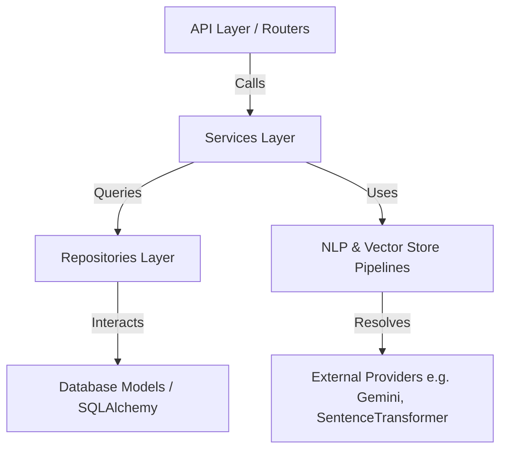

# Backend Architecture Document — AI Study Assistant

This document outlines the architectural patterns, folder structure, module responsibilities, and future extensibility blueprints for the AI Study Assistant backend.

---

## 1. Directory Structure

The backend follows the principles of Clean Architecture and Domain-Driven Design (DDD). It is organized as follows:

```text
app/
├── api/                   # Presentation Layer (API Endpoints & Routers)
│   └── v1/                # Version 1 endpoints (auth.py, workspace.py, documents.py, etc.)
├── core/                  # Core Application Configurations, Security, & Logging
│   ├── config.py          # Environment settings
│   └── logging.py         # Centralized logging setup
├── database/              # Infrastructure Layer: Database Config & Models
│   ├── models/            # SQLAlchemy Entities (User, Workspace, Document, etc.)
│   └── session.py         # DB Engine and session context managers
├── dependencies/          # Dependency Injection (Auth helper, DB injection)
├── exceptions/            # Custom application-wide exception hierarchy
├── repositories/          # Infrastructure Layer: Data Access Pattern
│   ├── base.py            # Generic repository contract
│   └── user_repository.py # Domain-specific repositories
├── services/              # Application Layer: Domain Business Logic
│   ├── auth/              # Authentication Orchestration Service
│   ├── workspace/         # Workspace Operations Service
│   └── document/          # Document Operations and Processing Services
├── security/              # Cryptographic, JWT token, and hashing utilities
├── text/                  # Core NLP pipeline: Text processing and sanitization
├── chunking/              # Chunker module: Document text segmentation
├── embedding/             # Embedding provider engine (SentenceTransformers)
├── vectorstore/           # FAISS Vector Storage and retrieval indices
├── retrieval/             # Context retrieval pipelines matching user queries
├── prompts/               # Prompt Engineering module
│   ├── shared/            # Common builders, templates, budgets, and formatters
│   ├── chat/              # Empty (Prepared for Phase 13 Chat features)
│   ├── summary/           # Empty (Prepared for Summary features)
│   ├── quiz/              # Empty (Prepared for Quiz generation features)
│   └── flashcards/        # Empty (Prepared for Flashcards generation features)
├── ai/                    # Prepared Advanced AI Core Layer
│   ├── chat/              # Chat orchestration
│   ├── graph/             # LangGraph stateful multi-agent workflows
│   ├── summary/           # Summarization pipelines
│   ├── quiz/              # Quiz generation engines
│   ├── flashcards/        # Flashcard generation engines
│   └── explain/           # Conceptual explainer pipeline
├── utils/                 # General application-wide utilities namespace
├── workers/               # Background task workers (e.g. Celery / RQ) namespace
└── main.py                # Application entry point
```

---

## 2. Component Responsibilities

| Layer / Module | Responsibility |
| :--- | :--- |
| **API (`app/api`)** | Handles incoming HTTP requests, validates request payloads via Pydantic, and returns HTTP responses. Coordinates route security/auth dependencies. |
| **Services (`app/services`)** | Application Layer that implements the business use-cases. Orchestrates repositories, PDF processors, chunkers, and embedding providers. |
| **Repositories (`app/repositories`)** | Decouples business logic from SQLAlchemy queries. Provides interfaces for CRUD and pagination operations on the entities. |
| **Text Processing & Chunking** | Parses, cleanses, normalizes, and segments documents into semantic windows. |
| **Embedding & Vector Store** | Converts semantic text chunks into high-dimensional vectors and stores them locally in workspace FAISS indices. |
| **Retriever & Prompts** | Finds relevant context chunks using vector similarity, structures context, tracks token budgets, and formats structured prompts. |
| **AI Layer (`app/ai`)** | Orchestrates downstream AI features (QA, LangGraph workflows, quiz engines). |

---

## 3. Dependency Flow

Dependencies flow **inwards** according to Clean Architecture guidelines:



1. **API Routers** depend only on **Services** and **Dependencies** (such as authentication or DB session providers).
2. **Services** depend on **Repositories** for data persistence and other core sub-systems (like prompt builder, retriever, and vector stores).
3. **Repositories** depend only on the database connection and SQLAlchemy entities.
4. **Exceptions** are decoupled, allowing each module to raise domain exceptions that API routers convert to proper HTTP status codes.

---

## 4. Architectural Blueprints for Future Modules

### A. Future Chat Module
The `app/prompts/chat/` and `app/ai/chat/` directories are reserved for the conversation engine.
- **State Persistence**: Conversational memory will be persisted in the SQL Database via a `chat_session` and `chat_message` relationship.
- **RAG Integration**: The Chat module will invoke the retrieval pipeline to append relevant documents to the ongoing chat window.
- **Streaming**: Will expose an event-streaming API utilizing FastAPI's `StreamingResponse` for token-by-token generation.

### B. Future LangGraph Integration
The `app/ai/graph/` directory is prepared for stateful, multi-agent AI systems built on LangGraph.
- **State Management**: Defining state graphs to handle complex learning workflows (e.g., student self-assessment loops, iterative document summarization).
- **Agents**: Separate specialized nodes (e.g., *Syllabus Analyzer*, *Question Generator*, *Explanation Auditor*) that cooperate to answer complex learning queries.

### C. Future AI Modules (Summary, Quiz, Flashcards, Explain)
- **Summary**: Incremental summarization of large documents without violating token budgets.
- **Quiz**: Automatic generation of multiple-choice or short-answer quizzes based on document segments.
- **Flashcards**: Active recall generation.
- **Explain**: Simplification and elaboration of complex jargon utilizing Gemini providers.
