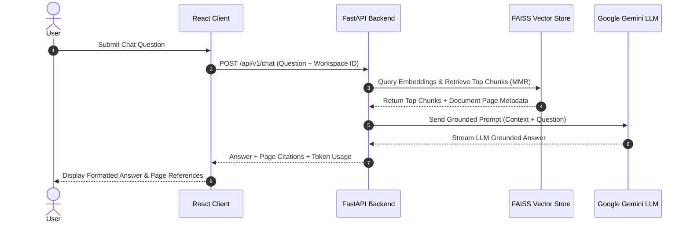

<div align="center">

# 📖 Documentation & Architecture Decision Log

### Deep-dive Technical Documentation & Architecture Decision Records (ADRs) for **AI Study Assistant**

---

</div>

## 📌 Table of Contents

- [🏛️ Architecture Decision Records (ADRs)](#️-architecture-decision-records-adrs)
- [🔄 RAG Pipeline & Data Flow Diagrams](#-rag-pipeline--data-flow-diagrams)
- [🧪 Testing & Quality Assurance Specs](#-testing--quality-assurance-specs)
- [🔗 Reference Documentation](#-reference-documentation)

---

## 🏛️ Architecture Decision Records (ADRs)

<details open>
<summary><b>ADR 001: RAG Pipeline with FAISS Vector Store & Google Gemini</b></summary>

- **Status**: Accepted & Implemented
- **Context**: Need fast, accurate semantic search over user-uploaded PDF/text study materials with low-latency LLM answers.
- **Decision**: Used `FAISS` for local vector similarity search paired with `Sentence Transformers` embeddings and `Google Gemini` (`gemini-2.5-flash`) for grounded answer generation with page citations.
- **Consequences**: Fast retrieval time (<100ms vector search) with strict factual grounding against hallucination.

</details>

<details open>
<summary><b>ADR 002: Modular Domain-Driven React Frontend Architecture</b></summary>

- **Status**: Accepted & Implemented
- **Context**: Need a scalable frontend architecture that avoids flat component dumping as features grow.
- **Decision**: Structured the frontend into self-contained domain modules (`src/modules/Auth`, `src/modules/Documents`, `src/modules/Chat`, `src/modules/Summary`, `src/modules/Analytics`). Each module encapsulates its own components, hooks, schemas, and barrel exports.
- **Consequences**: Clear separation of concerns, high reusability, and easy maintainability.

</details>

<details open>
<summary><b>ADR 003: Headless TanStack Data Table for Document & Summaries Library</b></summary>

- **Status**: Accepted & Implemented
- **Context**: Standard HTML tables lack sorting, per-column filtering, row selection, and pagination required for managing large study document libraries.
- **Decision**: Integrated headless `@tanstack/react-table` (v8) wrapped in a generic `<DataTable<TData, TValue>>` primitive supporting both client-side and server-side mode.
- **Consequences**: Powers **DocumentManager**, **Summaries Library Table**, and **AI Usage Analytics Table** with full sorting, filtering, and selection capabilities.

</details>

<details open>
<summary><b>ADR 004: Redux Toolkit + React Context Hybrid State Management</b></summary>

- **Status**: Accepted & Implemented
- **Context**: Global UI state (active workspace, tabs, themes, auth tokens) needs centralized state management without prop drilling.
- **Decision**: Combined Redux Toolkit (`@reduxjs/toolkit`) for global slices (`authSlice`, `workspaceSlice`, `uiSlice`) alongside React Context API (`AuthContext`, `WorkspaceContext`, `DocumentContext`, `ChatContext`).
- **Consequences**: Clean state predictability with typed `useAppDispatch` and `useAppSelector` hooks.

</details>

<details open>
<summary><b>ADR 005: React Hook Form + Yup Validation & Base Axios Client</b></summary>

- **Status**: Accepted & Implemented
- **Context**: Forms require instant validation feedback, accessibility, and resilient HTTP request interceptors for token auto-refresh.
- **Decision**: Paired `react-hook-form` with `@hookform/resolvers/yup` schemas and created `src/base-axios/` with Bearer token interceptors and silent `401 Unauthorized` token refresh queueing.
- **Consequences**: Zero invalid form submissions and automatic handling of expired access tokens.

</details>

<details open>
<summary><b>ADR 006: Comprehensive Vitest, Playwright, and Pytest Testing Framework</b></summary>

- **Status**: Accepted & Implemented
- **Context**: End-to-end reliability requirements across frontend UI, form schemas, tables, and backend APIs.
- **Decision**: Implemented `Vitest` unit test suite (7 tests), `Playwright` E2E browser tests, and `Pytest` backend test suite (138 tests).
- **Consequences**: 100% test passing rate across frontend and backend builds.

</details>

---

## 🔄 RAG Pipeline & Data Flow Diagrams

<details>
<summary><b>📊 View System Architecture Flow Diagram</b></summary>

```text
               React Frontend (Vite + TypeScript)
                               │
               ┌───────────────┴───────────────┐
               ▼                               ▼
       TanStack Query / Table           Redux Toolkit / Axios
               │                               │
               └───────────────┬───────────────┘
                               │ (REST API / Bearer JWT)
                               ▼
                        FastAPI Server
                               │
       ┌───────────────────────┼───────────────────────┐
       ▼                       ▼                       ▼
Authentication           Workspace API           Document API
                                                       │
                                                       ▼
                                                PDF/Doc Ingestion
                                                       │
                                                       ▼
                                                Text Processing & Chunking
                                                       │
                                                       ▼
                                                Embedding Service
                                                       │
                                                       ▼
                                                FAISS Vector DB
                                                       │
                                                       ▼
                                              Semantic Retrieval (MMR)
                                                       │
                                                       ▼
                                                Google Gemini LLM
                                                       │
                                                       ▼
                                                Grounded Response
```

</details>

<details>
<summary><b>🔄 View RAG Execution Sequence Flow</b></summary>



</details>

---

## 🧪 Testing & Quality Assurance Specs

- **Frontend Vitest Specs**: [frontend/src/test](file:///home/vishal-dave/Desktop/ai-study-assistant/frontend/src/test)
- **Frontend Playwright E2E Specs**: [frontend/e2e](file:///home/vishal-dave/Desktop/ai-study-assistant/frontend/e2e)
- **Backend Pytest Specs**: [backend/tests](file:///home/vishal-dave/Desktop/ai-study-assistant/backend/tests)

---

## 🔗 Reference Documentation

- High-Level Application README: [README.md](file:///home/vishal-dave/Desktop/ai-study-assistant/README.md)
- OpenAPI Swagger Endpoint: `http://localhost:8000/docs`
